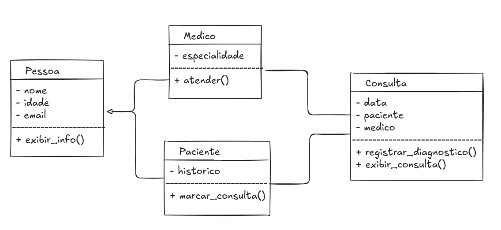

# aula-02 POO - 29/08/2025
diagramas de classes UML; classes e métodos

# Rodar o container

    docker compose up -d

# Acessar o container no terminal

    docker exec -it aula-poo bash

# Executar os scripts Python
    python exemplo.py

    python atividade.py

# Atividades

### 1. No arquivo `atividade.py` crie as Classes `Pessoa`, `Medico`, `Paciente`, obedecendo o seguinte diagrama uml:

### 2. Ainda no arquivo `atividade.py`, crie o código responsável pelas funcionalidades de `Cadastrar Paciente`, `Listar Pacientes` e `Listar Consultas`

### 3. Desafio extra: caso a sua versão final do arquivo `atividade.py` tenha repetição de trecho de código, por exemplo nas funcionalidades de `Cadastrar Paciente` e `Cadastrar Médico`, utilize a técnica DRY (Don't Repeat Yourself) para refatorar o código de forma a torná-lo mais legível, por exemplo, centralizando a coleta de informações em um único ponto.